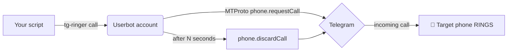

# 📞 tg-ringer

**Make your phone *ring* on a critical event — for free, through Telegram.**

`tg-ringer` is a tiny [Telethon](https://github.com/LonamiWebs/Telethon) **userbot**
that places a real **private Telegram call** from your own account so the target's
phone actually rings (no audio — the ring *is* the alert), then hangs up. It can also
send direct account-to-account messages.

<p>
  <a href="https://pypi.org/project/tg-ringer/"></a>
  <a href="https://github.com/jdp5949/tg-ringer"></a>
  <a href="https://github.com/jdp5949/tg-ringer/blob/main/LICENSE"></a>
  
</p>

[⭐ GitHub](https://github.com/jdp5949/tg-ringer) ·
[📦 PyPI](https://pypi.org/project/tg-ringer/)

---

## Why it exists

Telegram **bots cannot place calls**. A *userbot* (your own account, over MTProto)
can. A silent push notification at 3 a.m. is easy to sleep through — **a ringing
phone is not**. `tg-ringer` turns any script event into a phone ring using the
Telegram account you already have, with zero monthly cost.

---

## What it can do

| Capability | Notes |
|------------|-------|
| 📞 **Ring a phone** | Real incoming Telegram call → device rings, then auto hang-up. |
| 💬 **Direct message** | Account-to-account text (not a bot). |
| 🎯 **Target anything** | `@username`, numeric user id, or `+E164` phone number. |
| 🔁 **Auto-resolve numbers** | A `+phone` is imported as a temp contact so you can reach it. |
| ⏱️ **Control ring length** | `--seconds` / `RING_SECONDS`. |
| 🧩 **CLI + Python library** | Use from shell scripts or import `tg_ringer`. |
| 🤖 **MCP server** | Claude Code / AI agent integration — 5 Telegram tools over stdio. |
| 🆓 **Free** | No paid telephony, no per-call cost. |

---

## Available in 5 languages 🌍

Same tool, your stack. Pick a language — each has its own repo, CI, and downloadable
builds on GitHub (no account or token needed to install).

| Language | Install | Downloads |
|----------|---------|-----------|
| 🐍 **Python** | `pip install tg-ringer` | [PyPI](https://pypi.org/project/tg-ringer/) |
| 🐹 **Go** | `go install github.com/jdp5949/tg-ringer-go/cmd/tg-ringer@latest` | [binaries](https://github.com/jdp5949/tg-ringer-go/releases) (Linux/macOS/Windows) |
| 🟢 **Node/TS** | `npm install github:jdp5949/tg-ringer-js` | [tarball](https://github.com/jdp5949/tg-ringer-js/releases) |
| ☕ **Java** | JitPack: `com.github.jdp5949:tg-ringer-java:v0.1.0` | [jars](https://github.com/jdp5949/tg-ringer-java/releases) |
| 🦀 **Rust** | `cargo install --git https://github.com/jdp5949/tg-ringer-rs` | [binaries](https://github.com/jdp5949/tg-ringer-rs/releases) |

> Python is the reference implementation (live-tested). Go is a native gotd/td port.
> Java and Rust wrap the native Go binary. Node is a native GramJS port. The Go/Node/Rust/Java
> ports are **beta** — same logic as Python, community testing welcome. 🙏

---

## How it works



1. The userbot generates the Diffie-Hellman values Telegram requires.
2. It sends `phone.requestCall` → the target's device **rings**.
3. After `seconds`, it sends `phone.discardCall` to hang up.

No audio stream is negotiated — establishing the ring is enough to alert you.

---

## Quick start (3 steps)

```bash
# 1. install
pip install tg-ringer

# 2. log in — prompts for api_id / api_hash (from https://my.telegram.org),
#    saves them, then signs the userbot in. No config files to edit.
tg-ringer login

# 3. ring a phone
tg-ringer call +15551234567
```

> Use a **separate** Telegram account as the userbot — you can't call yourself.
> The login code arrives **inside Telegram** (the "Telegram" service chat), not SMS.

That's it. `login` walks you through setup the first time; later runs just sign in.

---

## Usage

### Commands (all languages)

| Command | What it does |
|---------|--------------|
| `login` | Interactive setup (api_id/api_hash) + sign in |
| `init` | (Re)configure credentials only |
| `config` | Show current config (api_hash masked) |
| `call TARGET [secs]` | Ring a user/number, then hang up |
| `msg TARGET TEXT…` | Send a direct message |
| `whoami` | Show the logged-in account |
| `status` | Check anti-spam state via `@SpamBot` |

`TARGET` = `@username`, numeric id, or `+E164` phone number.

> All commands — including `status` — are available in **all five languages**
> (Rust and Java run the native Go binary under the hood).

### Running the CLI in each language

```bash
# Python  (pip install tg-ringer)
tg-ringer call +15551234567

# Go      (downloaded binary or `go install`)
tg-ringer call +15551234567

# Rust    (downloaded binary or `cargo install`)
tg-ringer call +15551234567

# Node    (npm install github:jdp5949/tg-ringer-js)
npx tg-ringer call +15551234567

# Java    (downloaded runnable jar)
java -jar tg-ringer-java-0.1.0.jar call +15551234567
```

Examples (any CLI):

```bash
tg-ringer login                       # first-time setup + sign in
tg-ringer call                        # ring the default target (TG_TARGET)
tg-ringer call @someuser 30           # ring @someuser for 30s
tg-ringer msg  +15551234567 "deploy finished"
tg-ringer status                      # is my account flagged?
```

### Library usage per language

**Python**
```python
import asyncio
from tg_ringer import TgCaller

async def main():
    async with TgCaller(api_id, api_hash, "userbot") as tg:
        await tg.ring("+15551234567", seconds=20)
        await tg.message("+15551234567", "heads up")

asyncio.run(main())
```

**Go**
```go
import "github.com/jdp5949/tg-ringer-go/ringer"

ringer.Run(ctx, cfg, func(ctx context.Context, c *ringer.Client) error {
    _, err := c.Ring(ctx, "+15551234567", 20)
    return err
})
```

**Node / TypeScript**
```ts
import { TgRinger } from "tg-ringer";

const r = new TgRinger({ apiId, apiHash, session });
await r.connect();
await r.ring("+15551234567", 20);
await r.message("+15551234567", "heads up");
await r.disconnect();
```

**Rust**
```rust
tg_ringer::ring("+15551234567", 20)?;
tg_ringer::message("+15551234567", "heads up")?;
```

**Java**
```java
import io.github.jdp5949.tgringer.TgRinger;

TgRinger tg = new TgRinger();
tg.ring("+15551234567", 20);
tg.message("+15551234567", "heads up");
```

### Configuration

`tg-ringer login`/`init` save everything for you to `~/.config/tg-ringer/config`
(chmod 600). You rarely need to touch it. Values can also be supplied as environment
variables (handy for CI), which take precedence:

| Var | Meaning |
|-----|---------|
| `TG_API_ID`, `TG_API_HASH` | credentials (from my.telegram.org) |
| `TG_TARGET` | default target for `call`/`msg` |
| `RING_SECONDS` | default ring duration (20) |
| `TG_SESSION` | session file path |
| `TG_RINGER_HOME` | config directory override |

---

## MCP server — Telegram tools for Claude Code and AI agents

`tg-ringer` ships a **stdio MCP server** (`tg-ringer-mcp`) that exposes Telegram
actions as tools any MCP-compatible AI agent can call: Claude Code, the Claude
desktop app, Cursor, Windsurf, or any custom agent using the MCP SDK.

### 5 MCP tools

| Tool | What it does |
|------|-------------|
| `tg_ring` | Ring a Telegram user (phone rings, no audio). Best for urgent interrupts. |
| `tg_message` | Send a direct message (quiet alert with detail). |
| `tg_whoami` | Show which userbot account is logged in. |
| `tg_status` | Check anti-spam status via `@SpamBot`. |
| `tg_ask` | Send a question, wait for your Telegram reply, return it to the agent. |

The killer tool is **`tg_ask`** — it lets an AI agent pause mid-task, message you
on Telegram, and continue only once you reply. Human-in-the-loop over Telegram.

### Install the MCP server

```bash
# on the machine that has the Telegram session (e.g. a remote server)
pip install 'tg-ringer[mcp]'
tg-ringer login   # if not already configured
```

### Connect Claude Code (via SSH)

The recommended setup: MCP server runs on a remote host you control, Claude Code
connects over stdio through SSH. No open ports, no token — SSH key is the auth.

```json
// ~/.claude/settings.json  (or project .claude/settings.json)
{
  "mcpServers": {
    "tg-ringer": {
      "command": "ssh",
      "args": ["your-server", "tg-ringer-mcp"]
    }
  }
}
```

If the `tg-ringer-mcp` binary isn't on the remote `PATH`, use the full path:

```json
"args": ["your-server", "/path/to/venv/bin/tg-ringer-mcp"]
```

### Connect Claude Code (local)

If the session lives on your laptop, skip SSH entirely:

```json
{
  "mcpServers": {
    "tg-ringer": {
      "command": "tg-ringer-mcp"
    }
  }
}
```

### Connect the Claude desktop app

Same JSON, placed in the Claude app's MCP config file
(`~/Library/Application Support/Claude/claude_desktop_config.json` on macOS):

```json
{
  "mcpServers": {
    "tg-ringer": {
      "command": "ssh",
      "args": ["your-server", "tg-ringer-mcp"]
    }
  }
}
```

### Connect Cursor / Windsurf / any MCP client

Any editor or agent that supports MCP servers over stdio works the same way —
point it at `tg-ringer-mcp` (local) or `ssh <host> tg-ringer-mcp` (remote).

### Using the tools

Once connected, tell Claude (or any agent) in plain English:

```
After you finish the migration, ping me on Telegram.
```

Claude will call `tg_message` automatically. Or more explicitly:

```
Ring me on Telegram if the tests fail.
```
→ Claude calls `tg_ring` on failure.

### tg_ask — human-in-the-loop via Telegram

The most powerful tool: Claude pauses, messages you, and waits for your reply
before continuing.

```
Before you delete those files, ask me via Telegram which ones to keep.
```

Flow:
1. Claude calls `tg_ask("Which files should I keep? Reply with filenames.")`
2. You get a Telegram DM: `🤖 Claude asks: Which files should I keep?`
3. You reply in Telegram: `keep src/core.py and tests/`
4. Claude receives your reply and continues with that input.

Example in a script:

```python
# Any agent SDK that supports MCP tool calls
result = await client.call_tool("tg_ask", {
    "question": "Prod deploy ready. Confirm? (yes/no)",
    "timeout": 300   # wait up to 5 minutes
})
# result = "yes"  ← your Telegram reply
```

---

## When to use it

✅ Phone should **ring** on a critical event
✅ Free alternative to paid call APIs, if you already use Telegram
✅ Account-to-account DMs from scripts

❌ Spoken/TTS audio in the call — *ring only* (use a PSTN provider like Twilio)
❌ Reaching someone with **no internet** — Telegram is VoIP
❌ Mass messaging / spam — instant ban

---

## Use cases

### 🚨 CI/CD failure → ring you
```bash
make deploy && tg-ringer msg "$ME" "✅ deploy ok" || tg-ringer call "$ME"
```

### 🖥️ Server health watchdog (cron)
```bash
# */2 * * * *  — ring if the API stops responding
curl -fsS https://api.example.com/health || tg-ringer call +15551234567
```

### 🌙 On-call / long job done
```bash
./train_model.sh; tg-ringer call "$ME"   # ring when an hours-long job finishes
```

### 📉 Threshold alert
```bash
[ "$(disk_used_pct)" -gt 90 ] && tg-ringer msg "$ME" "disk 90%+ on $(hostname)"
```

### 🔁 Escalation (message first, ring if still bad)
```bash
tg-ringer msg "$ME" "ALERT: queue backed up"
sleep 300
still_bad && tg-ringer call "$ME"
```

---

## Limitations

- **Ring only, no audio.** Private-call audio needs the fragile `libtgvoip` stack;
  `pytgcalls` only covers *group* voice chats. Use Twilio for spoken messages.
- **Receiver needs internet** (VoIP).
- **Anti-spam.** New accounts — and especially **VoIP numbers** — can hit
  `PeerFloodError`. Best results when caller and target are **mutual contacts**.

---

## ⚠️ ToS & bans

Automating a **user** account is a **gray area** under Telegram's Terms of Service.
Accounts can be limited or banned (especially VoIP numbers / new accounts making
automated calls). Keep volume low, use mutual contacts, use a throwaway account,
never spam. Check status via `@SpamBot`. You use this at your own risk.

---

## 💛 Help & contributing

We're genuinely happy to help you get this working — it's free, open source (MIT),
and built to be useful. If you're stuck or have an idea:

- **Questions / bugs** → open an issue on the repo for your language:
  [Python](https://github.com/jdp5949/tg-ringer/issues) ·
  [Go](https://github.com/jdp5949/tg-ringer-go/issues) ·
  [Node](https://github.com/jdp5949/tg-ringer-js/issues) ·
  [Java](https://github.com/jdp5949/tg-ringer-java/issues) ·
  [Rust](https://github.com/jdp5949/tg-ringer-rs/issues)
- **Pull requests welcome** — docs, fixes, new language ports, real-world testing of
  the beta ports. No contribution is too small.
- **New to Telegram userbots?** Start with the [Quick start](#quick-start-3-steps)
  above; the `login` command walks you through everything.

If something in these docs is unclear, that's on us — tell us and we'll fix it. 🙌

---

## FAQ

**Is this a bot?** No — it's a *userbot* (your real account). Bots can't call.

**Will it ring on silent?** Telegram calls follow your Telegram call notification
settings; unmute the caller chat for reliable ringing.

**Can it call a regular phone with no Telegram?** No — both ends use Telegram (VoIP).
For true PSTN calls use Twilio/Vonage.

**Why `PeerFloodError`?** Telegram anti-spam. Use mutual contacts, avoid VoIP
numbers, keep volume low.

**Does it cost anything?** No.

---

<sub>MIT © jdp5949 · Independent project, not affiliated with Telegram.</sub>
