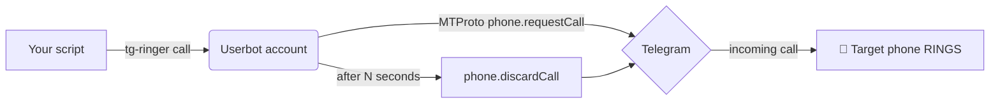

# 📞 tg-ringer

**Make your phone *ring* on a critical event — for free, through Telegram.**

`tg-ringer` is a tiny [Telethon](https://github.com/LonamiWebs/Telethon) **userbot**
that places a real **private Telegram call** from your own account so the target's
phone actually rings (no audio — the ring *is* the alert), then hangs up. It can also
send direct account-to-account messages.

<p>
  <a href="https://pypi.org/project/tg-ringer/"></a>
  <a href="https://github.com/jdp5949/tg-ringer"></a>
  <a href="https://github.com/jdp5949/tg-ringer/blob/main/LICENSE"></a>
  
</p>

[⭐ GitHub](https://github.com/jdp5949/tg-ringer) ·
[📦 PyPI](https://pypi.org/project/tg-ringer/)

---

## Why it exists

Telegram **bots cannot place calls**. A *userbot* (your own account, over MTProto)
can. A silent push notification at 3 a.m. is easy to sleep through — **a ringing
phone is not**. `tg-ringer` turns any script event into a phone ring using the
Telegram account you already have, with zero monthly cost.

---

## What it can do

| Capability | Notes |
|------------|-------|
| 📞 **Ring a phone** | Real incoming Telegram call → device rings, then auto hang-up. |
| 💬 **Direct message** | Account-to-account text (not a bot). |
| 🎯 **Target anything** | `@username`, numeric user id, or `+E164` phone number. |
| 🔁 **Auto-resolve numbers** | A `+phone` is imported as a temp contact so you can reach it. |
| ⏱️ **Control ring length** | `--seconds` / `RING_SECONDS`. |
| 🧩 **CLI + Python library** | Use from shell scripts or import `tg_ringer`. |
| 🆓 **Free** | No paid telephony, no per-call cost. |

---

## How it works



1. The userbot generates the Diffie-Hellman values Telegram requires.
2. It sends `phone.requestCall` → the target's device **rings**.
3. After `seconds`, it sends `phone.discardCall` to hang up.

No audio stream is negotiated — establishing the ring is enough to alert you.

---

## Quick start (3 steps)

```bash
# 1. install
pip install tg-ringer

# 2. log in — prompts for api_id / api_hash (from https://my.telegram.org),
#    saves them, then signs the userbot in. No config files to edit.
tg-ringer login

# 3. ring a phone
tg-ringer call +15551234567
```

> Use a **separate** Telegram account as the userbot — you can't call yourself.
> The login code arrives **inside Telegram** (the "Telegram" service chat), not SMS.

That's it. `login` walks you through setup the first time; later runs just sign in.

---

## Usage

### CLI

```bash
tg-ringer init                       # (re)configure credentials interactively
tg-ringer config                     # show current config (api_hash masked)
tg-ringer call +15551234567          # ring a number
tg-ringer call @someuser --seconds 30
tg-ringer call                       # ring the default target
tg-ringer msg  +15551234567 "deploy finished"
echo "piped body" | tg-ringer msg @someuser
tg-ringer whoami
```

### Python

```python
import asyncio
from tg_ringer import TgCaller

async def main():
    async with TgCaller(api_id, api_hash, "userbot") as tg:
        await tg.ring("+15551234567", seconds=20)
        await tg.message("+15551234567", "heads up")

asyncio.run(main())
```

### Configuration

`tg-ringer login`/`init` save everything for you to `~/.config/tg-ringer/config`
(chmod 600). You rarely need to touch it. Values can also be supplied as environment
variables (handy for CI), which take precedence:

| Var | Meaning |
|-----|---------|
| `TG_API_ID`, `TG_API_HASH` | credentials (from my.telegram.org) |
| `TG_TARGET` | default target for `call`/`msg` |
| `RING_SECONDS` | default ring duration (20) |
| `TG_SESSION` | session file path |
| `TG_RINGER_HOME` | config directory override |

---

## When to use it

✅ Phone should **ring** on a critical event
✅ Free alternative to paid call APIs, if you already use Telegram
✅ Account-to-account DMs from scripts

❌ Spoken/TTS audio in the call — *ring only* (use a PSTN provider like Twilio)
❌ Reaching someone with **no internet** — Telegram is VoIP
❌ Mass messaging / spam — instant ban

---

## Use cases

### 🚨 CI/CD failure → ring you
```bash
make deploy && tg-ringer msg "$ME" "✅ deploy ok" || tg-ringer call "$ME"
```

### 🖥️ Server health watchdog (cron)
```bash
# */2 * * * *  — ring if the API stops responding
curl -fsS https://api.example.com/health || tg-ringer call +15551234567
```

### 🌙 On-call / long job done
```bash
./train_model.sh; tg-ringer call "$ME"   # ring when an hours-long job finishes
```

### 📉 Threshold alert
```bash
[ "$(disk_used_pct)" -gt 90 ] && tg-ringer msg "$ME" "disk 90%+ on $(hostname)"
```

### 🔁 Escalation (message first, ring if still bad)
```bash
tg-ringer msg "$ME" "ALERT: queue backed up"
sleep 300
still_bad && tg-ringer call "$ME"
```

---

## Limitations

- **Ring only, no audio.** Private-call audio needs the fragile `libtgvoip` stack;
  `pytgcalls` only covers *group* voice chats. Use Twilio for spoken messages.
- **Receiver needs internet** (VoIP).
- **Anti-spam.** New accounts — and especially **VoIP numbers** — can hit
  `PeerFloodError`. Best results when caller and target are **mutual contacts**.

---

## ⚠️ ToS & bans

Automating a **user** account is a **gray area** under Telegram's Terms of Service.
Accounts can be limited or banned (especially VoIP numbers / new accounts making
automated calls). Keep volume low, use mutual contacts, use a throwaway account,
never spam. Check status via `@SpamBot`. You use this at your own risk.

---

## FAQ

**Is this a bot?** No — it's a *userbot* (your real account). Bots can't call.

**Will it ring on silent?** Telegram calls follow your Telegram call notification
settings; unmute the caller chat for reliable ringing.

**Can it call a regular phone with no Telegram?** No — both ends use Telegram (VoIP).
For true PSTN calls use Twilio/Vonage.

**Why `PeerFloodError`?** Telegram anti-spam. Use mutual contacts, avoid VoIP
numbers, keep volume low.

**Does it cost anything?** No.

---

<sub>MIT © jdp5949 · Independent project, not affiliated with Telegram.</sub>
